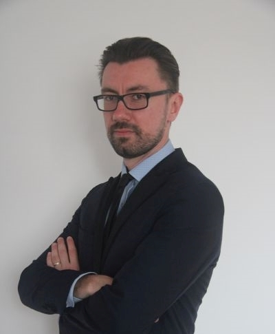

    

# Welcome!

This is a simple static site where you can find my portfolio related to two IT areas that I am most interested in.

* [Software Testing](..Software_Testing/index.md) - here you would find my latest commercial and noncommercial QA projects and reports
* [Technical Communication](..Technical_Communication/index.md) - as above, please feel free to check also my blog and guides I have created as a technical writer

In case of any more information necessary below you'll find my contact details. Feel free to call or text me any time:
* phone: +48 692 150 637
* e-mail: kamil.nowak.0086@gmail.com